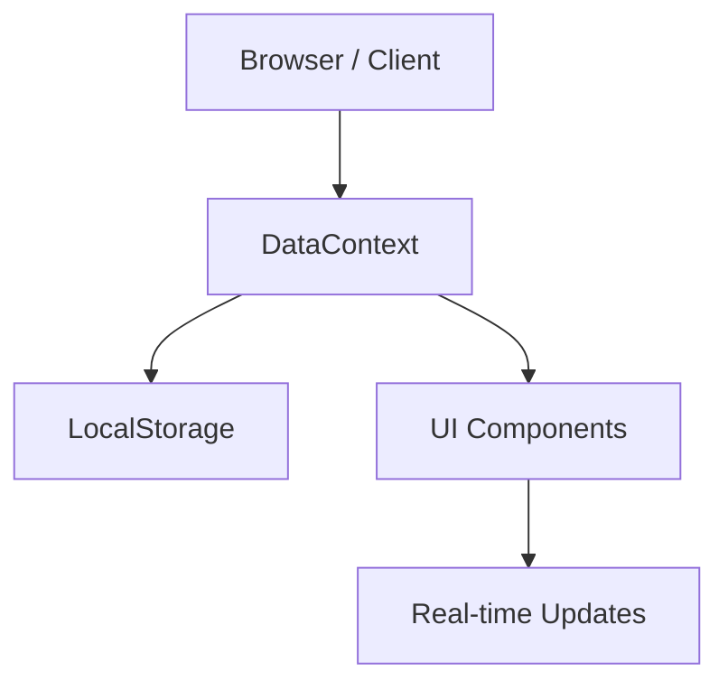

# StaffMNG – Academic & Staff Management System

A premium, modern Staff Management System built with **Next.js**, designed for high performance and seamless deployment. This application features a **fully client-side architecture** using **LocalStorage** for data persistence, making it exceptionally fast and Vercel-ready.

---

## 🚀 Getting Started

### Prerequisites

- **Node.js** 18+
- **npm** / yarn / pnpm

### Installation

1. Clone the repository.
2. Install dependencies:
   ```bash
   npm install
   ```
3. Start the development server:
   ```bash
   npm run dev
   ```
4. Open [http://localhost:3000](http://localhost:3000) (or the port shown in your terminal).

---

## ✨ Features

- **Staff Management**: Comprehensive directory for employees, departments, and positions.
- **Organization Tree**: Visual hierarchy of the institutional structure.
- **Collaborative Tasks**: Assign tasks to multiple faculty members with ease.
- **Task Boards**: Manage sub-tasks using a premium **Drag-and-Drop** kanban board inside each task.
- **Edit Profile**: Users can update their name, phone, address, and birth date with instant synchronization across the app.
- **Real-time Notifications**: In-app alerts for task assignments and completions.
- **Activity History**: High-level audit log for administrators to track institutional changes.
- **Role-Based Access**: Specialized views for Administrators, Managers, and Staff members.

---

## 🛠 Tech Stack

| Layer | Technology |
| :--- | :--- |
| **Framework** | Next.js (App Router, Client-First Logic) |
| **Persistence** | **LocalStorage** (Client-side JSON) |
| **State Mgmt** | React Context API (`DataContext`) |
| **UI/UX** | Tailwind CSS 4, Lucide Icons, Framer Motion |
| **Drag & Drop** | @dnd-kit (Core, Sortable, Utilities) |
| **Deployment** | Optimized for **Vercel** (Edge/Static Ready) |

---

## 🏗 Architecture

The application has been refactored for **Maximum Speed** and **Zero-Backend Dependency**:



- **DataContext**: Acts as the single source of truth, managing state and persisting data to `window.localStorage`.
- **Zero Latency**: Since all data operations happen locally, the UI is incredibly responsive with no waiting for server responses.
- **Vercel Optimized**: By removing Node.js-specific dependencies (like `fs`, `path`, and server-side `bcrypt`), the app can be deployed to any static or edge hosting environment without errors.

---

## 🔐 Permissions & Access

| Feature | Admin | Manager | Staff |
| :--- | :---: | :---: | :---: |
| Full Staff Directory | ✅ | ✅ | ❌ |
| Manage Depts/Positions | ✅ | ❌ | ❌ |
| Assign Tasks | ✅ | ✅ | ❌ |
| Edit Profile | ✅ | ✅ | ✅ |
| View Audit History | ✅ | ❌ | ❌ |

> [!IMPORTANT]
> **Task Completion Rule**: To ensure accountability, only the **Task Creator** (Assigner) or an **Admin** can mark a task as "Completed". Participants can update tasks to "In Progress" or "Pending".

---

## 📂 Project Structure

- `src/app/`: Modern Next.js App Router structure. All pages are marked `"use client"` for LocalStorage compatibility.
- `src/context/`: Contains `DataContext.tsx`, the heart of the application's data management.
- `src/components/`: Reusable premium UI components grouped by feature (tasks, admin, profile, layout).
- `src/lib/`: Utility functions and shared TypeScript interfaces.
- `src/lib/localStorage.ts`: SSR-safe wrapper for browser storage interactions.

---

## 📜 License

Private project.
