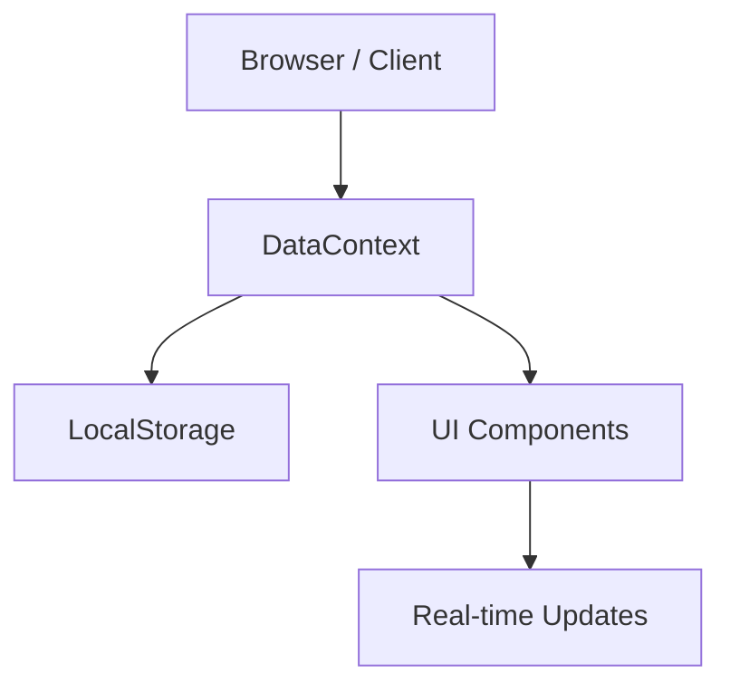

# StaffMNG – Academic & Staff Management System

A premium, modern Staff Management System built with **Next.js**, designed for high performance and seamless deployment. This application features a **fully client-side architecture** using **LocalStorage** for data persistence, making it exceptionally fast and Vercel-ready.

---

## 🚀 Getting Started

### Prerequisites

- **Node.js** 18+
- **npm** / yarn / pnpm

### Installation

1. Clone the repository.
2. Install dependencies:
   ```bash
   npm install
   ```
3. Start the development server:
   ```bash
   npm run dev
   ```
4. Open [http://localhost:3000](http://localhost:3000) (or the port shown in your terminal).

---

## ✨ Features

### 🏢 Organization & Staffing
- **Hierarchical Management**: Full support for manager-subordinate relationships. The system automatically prevents circular management loops (e.g., an employee cannot be the manager of their own manager).
- **Staff Directory**: Comprehensive management for employees, departments, and positions with a premium, searchable UI.
- **Smart Filtering**: Managers only see and interact with their own subordinates, ensuring strict institutional boundaries.

### 📋 Advanced Task Management
- **Multi-Role Tasks**:
    - **Assigners (Admins/Managers)**: Create tasks, assign members, and manage task lifecycle.
    - **Participants**: Execute tasks, update sub-task boards, and report completion.
- **Micro-Tasks & Boards**: Each task contains a premium **Drag-and-Drop** kanban board for managing granular task items.
- **Reactive UI**: Task status changes (Pending, In Progress, Completed) reflect immediately across the entire app without page reloads.

### 🔔 Intelligent Notifications
- **Real-time Alerts**: Automated notifications for task assignments, additions to existing tasks, and task completions.
- **Rejection Feedback**: If a completion is rejected by an assigner, participants are immediately notified to take further action.
- **Efficient Polling**: Syncs data every 10 seconds to maintain a real-time feel with zero server overhead.

### 🔐 Security & History
- **Role-Based Access (RBAC)**: Specialized permissions for Administrators, Managers, and Staff.
- **Audit Logging**: Comprehensive activity history tracking all major system events (employee creation, status changes, password updates).

---

## 🛠 Tech Stack

| Layer | Technology |
| :--- | :--- |
| **Framework** | Next.js 16 (App Router) |
| **Persistence** | **LocalStorage** (Client-side JSON) |
| **State Mgmt** | React Context API (`DataContext`) |
| **UI/UX** | Tailwind CSS 4, Lucide Icons, Framer Motion |
| **Drag & Drop** | @dnd-kit (Core, Sortable, Utilities) |
| **Deployment** | Optimized for **Vercel** (Edge/Static Ready) |

---

## 🏗 Architecture

The application has been refactored for **Maximum Speed** and **Zero-Backend Dependency**:



- **DataContext**: Acts as the single source of truth, managing state and persisting data to `window.localStorage`.
- **Zero Latency**: Since all data operations happen locally, the UI is incredibly responsive.
- **Vercel Optimized**: By removing Node.js-specific dependencies, the app can be deployed to any static or edge hosting environment without errors.

---

## 🔐 Permissions & Access

| Feature | Admin | Manager | Staff |
| :--- | :---: | :---: | :---: |
| Full Staff Directory | ✅ | ✅ | ❌ |
| Manage Depts/Positions | ✅ | ❌ | ❌ |
| Assign Tasks | ✅ | ✅ | ❌ |
| Edit Profile | ✅ | ✅ | ✅ |
| View Audit History | ✅ | ❌ | ❌ |

> [!IMPORTANT]
> **Task Completion Rule**: To ensure accountability, only the **Task Creator** (Assigner) or an **Admin** can mark a task as "Completed". Participants can update tasks to "In Progress" or "Pending".

---

## 📂 Project Structure

- `src/app/`: Next.js App Router. Pages are client-side for LocalStorage compatibility.
- `src/context/`: `DataContext.tsx` — The "Single Source of Truth" for the entire system.
- `src/components/`: Modular UI units (tasks, admin, profile, layout).
- `src/lib/`: SSR-safe wrappers, database interfaces, and TypeScript utilities.

---

## 📜 License

Private project.