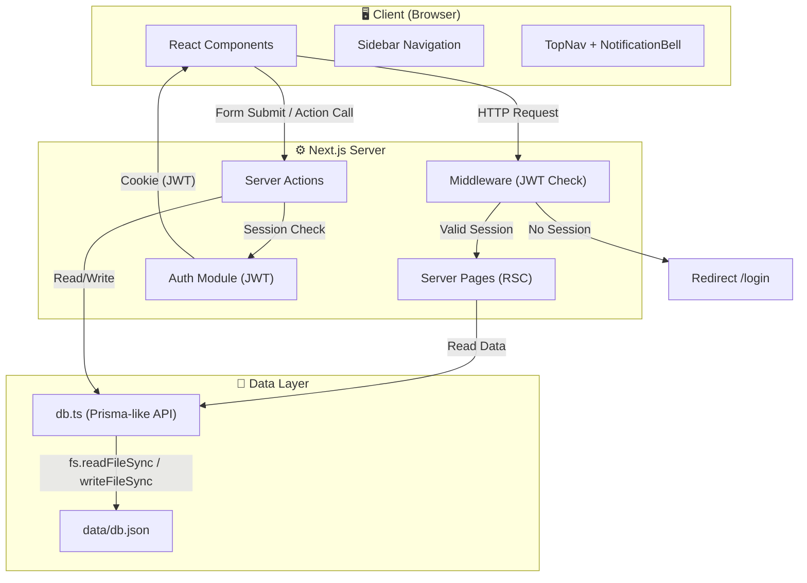
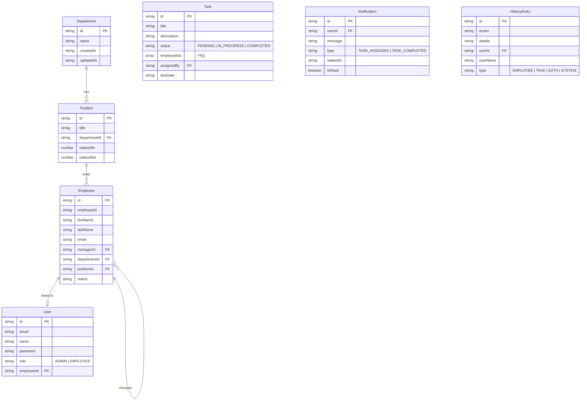

# StaffMNG - Hệ Thống Quản Lý Nhân Sự

**StaffMNG** là ứng dụng web quản lý nhân sự (HR Management System) hiện đại được xây dựng bằng **Next.js 15**, sử dụng **JSON file** làm cơ sở dữ liệu để đảm bảo tính gọn nhẹ và dễ triển khai.

## 🚀 Getting Started

### Prerequisites
- Node.js 18+ 
- npm / yarn / pnpm

### Installation
1. Clone the repository
2. Install dependencies:
   ```bash
   npm install
   ```
3. Run the development server:
   ```bash
   npm run dev
   ```
4. Open [http://localhost:3000](http://localhost:3000) in your browser.

---

## 📊 Báo Cáo Phân Tích Hệ Thống

### 1. Tổng Quan
Hệ thống hỗ trợ quản lý nhân viên, phòng ban, vị trí công việc, phân công nhiệm vụ cộng tác, thông báo real-time, và theo dõi lịch sử hoạt động.

| Thành phần | Công nghệ |
|---|---|
| Framework | Next.js 15 (App Router, Server Components, Server Actions) |
| Ngôn ngữ | TypeScript |
| Database | JSON file (`data/db.json`) |
| Authentication | JWT (jose) + bcryptjs |
| UI | Tailwind CSS + Lucide Icons |

---

### 2. Kiến Trúc Hệ Thống



---

### 3. Mô Hình Dữ Liệu (Database Schema)

Cơ sở dữ liệu gồm **7 bảng** lưu trong file `data/db.json`:



---

### 4. Hệ Thống Phân Quyền (Roles)

| Tính năng | ADMIN | EMPLOYEE (Manager) | EMPLOYEE |
|---|:---:|:---:|:---:|
| Dashboard tổng quan | ✅ | ❌ | ❌ |
| Dashboard cá nhân | ❌ | ✅ | ✅ |
| Xem tất cả tasks | ✅ | ❌ | ❌ |
| Xem tasks cá nhân | ✅ | ✅ | ✅ |
| Tạo task | ✅ Cho tất cả | ✅ Cho cấp dưới | ❌ |
| Xóa task | ✅ | ✅ Nếu là người giao | ❌ |
| Quản lý nhân viên | ✅ | ❌ | ❌ |
| Xem My Team | ✅ | ✅ | ✅ |
| Lịch sử hoạt động | ✅ | ❌ | ❌ |

---

### 5. Luồng Hoạt Động Chính

#### 5.1. Luồng Xác Thực (Authentication Flow)
1. User đăng nhập qua `loginAction`.
2. Hệ thống kiểm tra thông tin trong `db.json`.
3. Nếu đúng, tạo JWT token và lưu vào cookie "session".
4. Middleware bảo vệ các route, redirect về `/login` nếu chưa có session.

#### 5.2. Luồng Giao Nhiệm Vụ (Task Assignment)
1. Admin/Manager tạo task qua `createTaskAction`.
2. Task được lưu vào database với mảng `employeeIds`.
3. Hệ thống gửi thông báo (Notifications) đến tất cả nhân viên tham gia.
4. Ghi lại lịch sử hoạt động (History).

---

### 6. Cấu Trúc Thư Mục

- `src/app/`: Chứa các trang (Dashboard, Tasks, Employees, History, Profile...).
- `src/actions/`: Server Actions xử lý logic nghiệp vụ (Auth, Task, Employee...).
- `src/components/`: Các UI components tái sử dụng (Layout, Admin tools, Employee tools...).
- `src/lib/`: Lớp dữ liệu (`db.ts`) và logic phiên làm việc (`session.ts`).
- `data/db.json`: File cơ sở dữ liệu vật lý.

---

### 7. Tóm Tắt Đặc Điểm Nổi Bật

1. **JSON-based Persistence**: Không cần cài đặt SQL server, dữ liệu lưu trực tiếp vào file.
2. **Role-Based Access Control (RBAC)**: Phân quyền chặt chẽ giữa Admin, Manager và Nhân viên.
3. **Collaborative Tasking**: Một nhiệm vụ có thể giao cho nhiều người cùng tham gia.
4. **Activity Logging**: Lưu vết mọi hành động sửa đổi quan trọng trên hệ thống.
5. **Real-time UI Logic**: Sử dụng Next.js Server Actions và `revalidatePath` để cập nhật giao diện ngay lập tức.

---

## 🛠️ Hạn chế & Hướng phát triển (Roadmap)

Dù đã hoàn thiện các luồng cốt lõi, hệ thống vẫn còn một số điểm cần cải thiện:

### 1. Các trang chưa hiện thực (UI Placeholder)
- **Attendance (Điểm danh)**: Menu hiện có nhưng chưa có trang xử lý log vào/ra.
- **Leave Requests (Nghỉ phép)**: Chưa có form gửi và duyệt đơn nghỉ phép.
- **Departments & Positions**: Hiện tại đang quản lý cứng trong code/db, chưa có UI để Admin thêm/sửa/xóa phòng ban và chức danh.

### 2. Tính năng hệ thống
- **Search (Tìm kiếm)**: Thanh tìm kiếm trên `TopNav` hiện mới chỉ là giao diện, chưa xử lý logic search global.
- **Edit Profile**: Người dùng chưa thể tự cập nhật thông tin cá nhân (Số điện thoại, Địa chỉ, Ảnh đại diện).
- **Password Recovery**: Chưa có luồng quên mật khẩu qua Email.

### 3. Kỹ thuật & Bảo mật
- **Database**: Sử dụng file JSON không phù hợp cho hệ thống lớn hoặc có nhiều người truy cập đồng thời (dễ gây xung đột dữ liệu). Cần chuyển sang **PostgreSQL** hoặc **MongoDB**.
- **Security**: `secretKey` của JWT hiện đang để cứng, cần chuyển vào biến môi trường `.env`.
- **Validation**: Cần thêm các thư viện như `Zod` để validate dữ liệu đầu vào chặt chẽ hơn ở cả Client và Server.
- **Testing**: Chưa có Unit Test hoặc E2E Test để đảm bảo tính ổn định khi nâng cấp code.